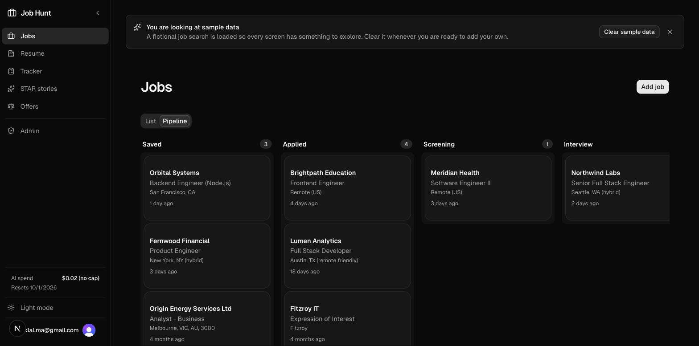
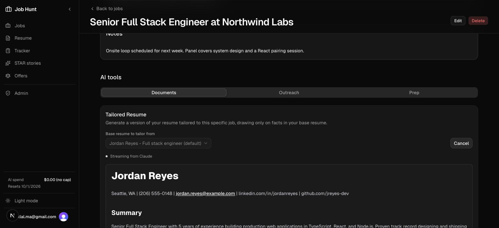
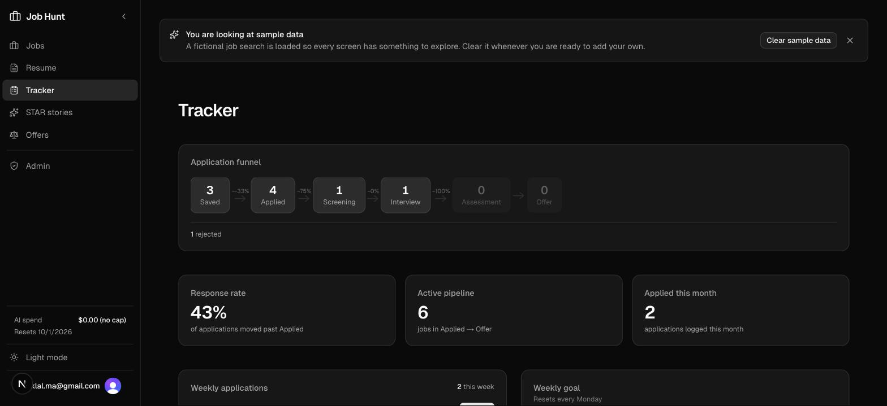
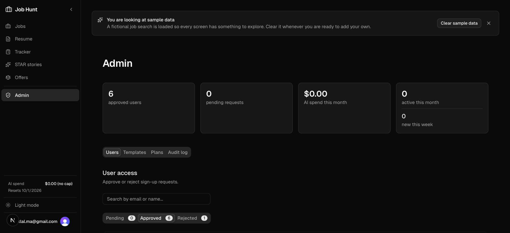
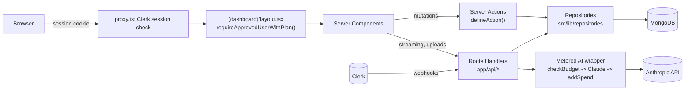

# JobHunt

An AI-assisted job search workspace. Track applications through a kanban pipeline, tailor your resume and cover letter to each posting with Claude, prep for interviews, compare offers, and export finished documents as DOCX or LaTeX.

[](https://github.com/aashiklal/job-hunt-app/actions/workflows/ci.yml)
[](LICENSE)

**Live demo:** <!-- TODO: paste the Vercel URL --> https://YOUR-VERCEL-URL

Sign up with any email and you land straight in the app with a one-time $0.50 AI credit, enough for one complete pass through the workflow with your own resume and a real job posting. A guided tour points at each step in order. Once the credit is spent, request full access with one click.

---

## Screenshots

| Pipeline | Job detail with streaming generation |
|---|---|
|  |  |

| Tracker | Admin |
|---|---|
|  |  |

---

## What it does

**Track**
- Kanban pipeline with drag-and-drop status changes (optimistic UI via React 19 `useOptimistic`), plus a table view.
- Quick import: paste a job posting and Claude extracts company, role, location, salary, and description.
- Soft delete with a trash bin and restore.
- Tracker dashboard: funnel counts, response rate, weekly application chart, stale-application alerts, weekly goal.

**Tailor**
- Upload a PDF or DOCX resume; text is extracted server-side. Keep several versions and mark one as default.
- Generate a tailored resume or cover letter for a specific job. Output streams in progressively as structured JSON is parsed on the fly.
- JD analysis: required skills, nice-to-haves, keywords, likely interview focus, red flags.
- Fit score and ATS score: deterministic keyword coverage of your resume against the analysed JD.
- Skills gap: aggregates every analysed JD into a missing-skills list and learning roadmap.

**Prepare**
- Interview prep: behavioral, technical, role-specific, and culture-fit questions with hints, plus questions to ask them.
- STAR stories: keep rough drafts of behavioral answers and polish them into STAR format.
- Outreach: LinkedIn connection notes and DMs, follow-up, thank-you, check-in, cold, and salary negotiation emails.

**Decide**
- Offer tracker with side-by-side comparison, pros and cons, and negotiation hints.

**Export**
- DOCX export. If an admin has uploaded a template, output is rendered against it with a pixel-aware theming pipeline that preserves fonts, sizes, and run styles. Otherwise a clean generic layout is used.
- LaTeX export (`.tex`) from a bundled template, cached per document.

**Operate**
- Every AI call is metered in USD per user per month against their plan's budget. Admins can set per-user overrides.
- Admin panel: approve or reject users, toggle admin, adjust plan limits, view spend, and read a full audit log.
- New sign-ups are approved instantly onto a free plan with a one-time $0.50 AI credit when `AUTO_APPROVE_SIGNUPS=true`, or held for admin approval when it is unset. A free-plan user can request full access (a monthly AI budget) at any time; an admin grants or declines it from `/admin`.

---

## Architecture



Request flow in one sentence: the proxy checks for a Clerk session, the dashboard layout resolves the user, subscription, and plan once per request, pages read through repositories, and every AI call goes through a metered wrapper that checks the budget before calling Claude and records spend after.

### Engineering highlights

- **Layering enforced by lint.** An ESLint `no-restricted-imports` rule blocks importing Mongoose models anywhere outside `src/lib/repositories`, so all data access goes through one layer.
- **Ownership baked into every query.** Every repository function takes `userId` as its first argument and filters on it, so a user can never read or write another user's records by guessing an id.
- **Uniform Server Action contract.** `defineAction()` and `defineAdminAction()` wrap auth, validation, and error mapping, and always return `{ ok, data | error }`.
- **Metered AI spend.** Per-token USD accounting against either a monthly or a one-time lifetime budget depending on plan, with per-user overrides and an audit trail.
- **Guided onboarding.** A driver.js coach mark walks a new user through one full pass of the workflow, computed live from their own records rather than seeded demo data.
- **Progressive streaming of structured output.** The model streams JSON; the server parses the partial buffer with a lenient parser and renders a markdown preview that only ever grows, then validates the final message with zod before saving.
- **Hardened route handlers.** Every API route authenticates, validates bodies with zod, caps upload sizes, returns precise status codes, and never leaks raw error messages.
- **Tests and CI.** Vitest covers the pure logic (cost calculation, fit scoring, markdown rendering, streaming previews) and the route handler with mocked dependencies. GitHub Actions runs typecheck, lint, tests, and a production build on every push.

---

## Tech stack

| Layer | Technology |
|---|---|
| Framework | Next.js 16 (App Router, Turbopack), React 19, TypeScript strict |
| UI | Tailwind CSS v4, shadcn/ui, Radix UI, lucide-react, next-themes, sonner, driver.js |
| Auth | Clerk (hosted pages, Svix-verified webhooks) |
| Database | MongoDB via Mongoose |
| AI | Anthropic Claude via `@anthropic-ai/sdk`, streaming with `partial-json` |
| Drag and drop | dnd-kit |
| Forms | react-hook-form + zod |
| Documents | docx, jszip, mammoth, unpdf |
| Email | Resend (admin notifications), optional Telegram |
| Tests | Vitest |
| Hosting | Vercel |

---

## Getting started

### Prerequisites

- Node.js 20 (see `.nvmrc`)
- A MongoDB database (Atlas free tier works)
- A [Clerk](https://clerk.com) application
- An [Anthropic](https://console.anthropic.com) API key
- A [Resend](https://resend.com) account (optional, for admin sign-up emails)

### 1. Configure

```bash
cp .env.example .env.local
```

| Variable | Required | Purpose |
|---|---|---|
| `MONGODB_URI` | yes | MongoDB connection string |
| `ANTHROPIC_API_KEY` | yes | Claude API key |
| `CLERK_SECRET_KEY` | yes | Clerk server key |
| `NEXT_PUBLIC_CLERK_PUBLISHABLE_KEY` | yes | Clerk browser key |
| `NEXT_PUBLIC_CLERK_SIGN_IN_URL` / `NEXT_PUBLIC_CLERK_SIGN_UP_URL` | yes | `/sign-in` and `/sign-up` |
| `CLERK_WEBHOOK_SIGNING_SECRET` | yes | Verifies Clerk webhooks |
| `AUTO_APPROVE_SIGNUPS` | no | `true` approves sign-ups instantly on the free plan; unset requires admin approval |
| `NEXT_PUBLIC_APP_URL` | no | Base URL used in notification links (Vercel sets it automatically) |
| `RESEND_API_KEY` / `RESEND_FROM_EMAIL` | no | Admin sign-up notifications |
| `TELEGRAM_BOT_TOKEN` / `TELEGRAM_CHAT_ID` | no | Telegram sign-up notifications |

### 2. Install and seed

```bash
npm install
npm run seed:plans      # creates the "personal" and "free" plans
```

### 3. Run

```bash
npm run dev
```

Open http://localhost:3000. With `AUTO_APPROVE_SIGNUPS=true` the first account you create lands straight in the app on the free plan.

To make yourself an admin:

```bash
npm run bootstrap:admin -- you@example.com
```

### Clerk webhook (optional locally)

The app syncs `user.created`, `user.updated`, and `user.deleted` into MongoDB. In production, add a webhook endpoint in the Clerk dashboard pointing at `https://<your-domain>/api/webhooks/clerk` and copy the signing secret into `CLERK_WEBHOOK_SIGNING_SECRET`. Locally the app creates the user record lazily on first request, so the webhook is only needed to test deletions.

---

## Scripts

| Command | Purpose |
|---|---|
| `npm run dev` | Dev server (Turbopack) |
| `npm run build` / `npm start` | Production build and server |
| `npm run typecheck` | `tsc --noEmit` |
| `npm run lint` | ESLint |
| `npm test` / `npm run test:watch` | Vitest |
| `npm run seed:plans` | Upsert the plan documents |
| `npm run bootstrap:admin -- <email>` | Promote a user to admin |
| `npm run backfill:subscriptions` | Create subscriptions for pre-existing approved users |
| `npm run test:generate` | Manual smoke test of the generation pipeline against a running server |
| `npm run test:docx-export` | Manual fixture-driven DOCX export harness |

---

## Testing

```bash
npm test
```

Tests live next to the code as `*.test.ts` and run under Vitest with the `@` alias and a `server-only` stub (see `vitest.config.ts`). They mock the repository layer rather than hitting a database. Coverage today:

- Cost calculation and quota errors (`src/lib/usage.test.ts`)
- Fit score and bands (`src/lib/fit-score.test.ts`)
- Job status transitions (`src/lib/models/Job.test.ts`)
- Markdown parsing for export (`src/lib/export/parse-markdown.test.ts`)
- Document rendering and progressive streaming previews (`src/lib/generated-documents.test.ts`)
- Onboarding tour progress computation (`src/lib/onboarding.test.ts`)
- Quota-exceeded copy for monthly vs lifetime plans (`src/lib/quota-copy.test.ts`)
- Sign-up activation with and without auto-approval (`src/lib/user-access-lifecycle.test.ts`)
- The generation route: auth, validation, error mapping, JSON and NDJSON responses (`src/app/api/generate/route.test.ts`)

---

## Project structure

```
src/
  proxy.ts                        Clerk session check (Next.js 16 replacement for middleware)
  app/
    page.tsx                      Public landing page
    (dashboard)/                  Approved users only; layout resolves user + plan once per request
      jobs/                       Pipeline, list, detail (AI panels), trash
      resume/                     Resume CRUD with plan-limited count
      offers/                     Offer CRUD + comparison
      star-stories/               STAR story CRUD + polish
      tracker/                    Funnel, weekly chart, stale alerts
      admin/                      Users, per-user limits, audit log, templates
      _components/                Usage widget, request-access button, onboarding tour
    api/
      generate/                   AI generation; NDJSON stream for resume and cover letter
      documents/[id]/export/      DOCX and LaTeX export
      jobs/parse/                 Quick import
      skills-gap/, offers/compare/, star-stories/polish/
      resume/parse-pdf/, resume/parse-docx/
      admin/templates/            Admin DOCX template upload
      webhooks/clerk/             Clerk user sync
  lib/
    auth-helpers.ts               requireApprovedUserWithPlan(), requireAdminWithPlan()
    actions.ts                    defineAction() / defineAdminAction()
    usage.ts                      checkBudget(), addSpend(), calculateCost(), MODEL_PRICING
    ai.ts, ai-execution.ts        Structured and streaming Claude calls, metered wrappers
    job-ai-generation.ts          Generation service for every AI type
    generated-documents.ts        Zod schemas, markdown rendering, partial-document preview
    onboarding.ts                  Getting-started tour progress, derived from the user's own data
    user-access-lifecycle.ts      Sign-up, activation, approval, full-access requests, audit
    models/                       Mongoose models
    repositories/                 All database access (one file per model)
    export/                       DOCX and LaTeX pipeline
scripts/                          Seed, bootstrap, and manual test harnesses
.github/workflows/ci.yml          Typecheck, lint, test, build
```

---

## Deployment

Designed for Vercel. Set the environment variables above in the project settings and push to `main`. After the first deploy, seed the plans against the production database:

```bash
MONGODB_URI=<production uri> npm run seed:plans
```

Then add the Clerk webhook endpoint and promote your own account with `npm run bootstrap:admin`.

---

## Known limitations and roadmap

- AI routes are protected by the USD budget (monthly or lifetime, by plan) but have no per-minute rate limit.
- Deleting a Clerk account removes the user record but does not yet cascade to their jobs, resumes, and documents.
- There is no error reporting or structured logging beyond console output.
- Cancelling a streaming generation part-way does not meter the tokens already consumed, because usage is only reported on the final message.
- PDF export does not exist; use DOCX or LaTeX.

---

## License

MIT. See [LICENSE](LICENSE).
