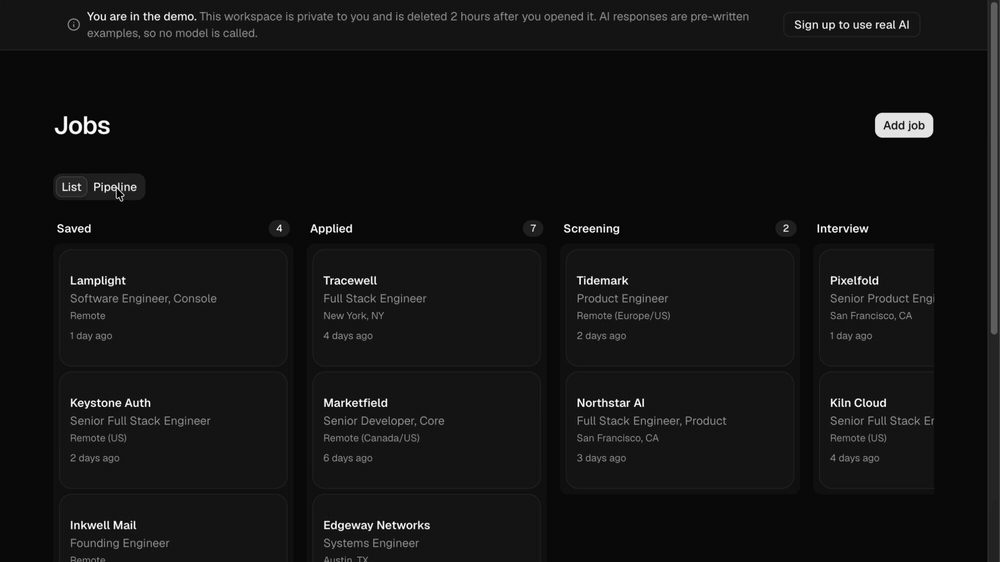
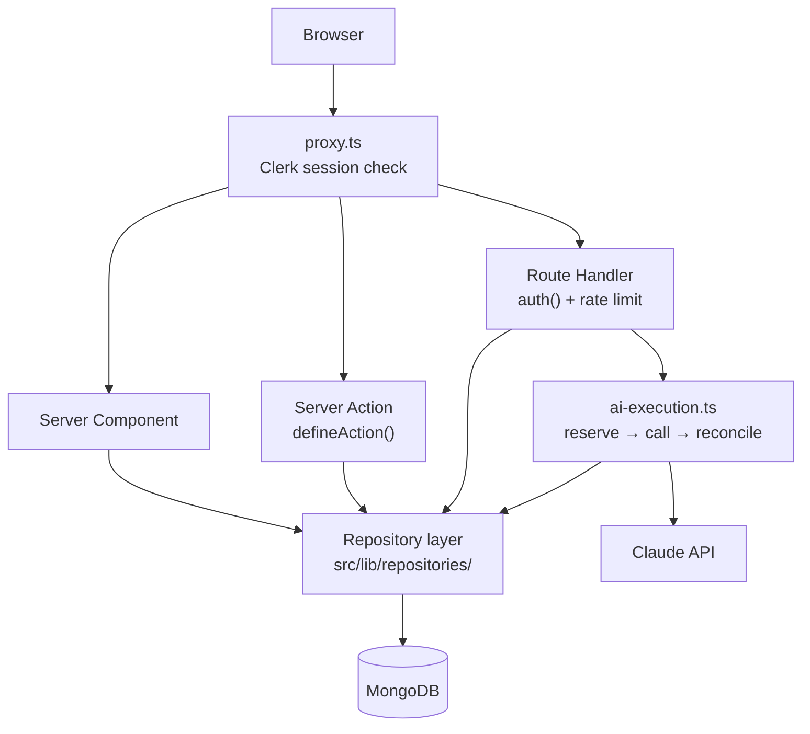

# Offerstitch

**An AI-assisted job application tracker.** Track every role through a kanban pipeline,
generate a tailored resume and cover letter against each job description, prepare for
interviews, and export the result as LaTeX or DOCX.

Built with Next.js 16 (App Router), React 19, MongoDB and the Claude API.



### [Try the live demo](https://offerstitch.vercel.app)

Click "Try the live demo" on the landing page. You get a private workspace with realistic
data already in it, fully interactive, deleted after 2 hours. Its AI requests are served from
fixtures, so nothing you do costs anything, and nobody else sees what you change.

---

## What it does

**Pipeline** — Kanban board with drag-and-drop across eight statuses, plus a table view.
Paste a job posting and Claude extracts the company, role, location, salary and description.
Soft delete with a trash bin and restore.

**Documents** — Store base resumes as plain text (uploaded PDF and DOCX are extracted
server-side). Generate a tailored resume, a cover letter, a structured job-description
analysis, interview prep, or one of eight outreach message types against any job. Export to
LaTeX or DOCX.

**Tracker** — Application funnel, response rate, weekly activity against a goal, and alerts
for applications that have gone quiet.

**Credits** — AI features are priced in credits, a monthly allowance set by the user's plan.
Each button shows its price before it is clicked, and the usage widget turns the balance
into something concrete ("About 12 tailored resumes or 25 cover letters").

**Admin** — Approve and reject users, edit plans (credit allowance, price, resume cap), give
one user their own credit allowance, manage export templates, see what each account costs
against what it pays, and read a paginated audit log of every admin action.

---

## Architecture

The parts worth looking at, and why they are the way they are. Longer form in
[`docs/adr/`](./docs/adr); domain vocabulary in [`CONTEXT.md`](./CONTEXT.md).

### Request flow



Every database query goes through the repository layer. Mutations go through Server Actions;
route handlers are reserved for the AI endpoints, file upload parsing, binary export and the
Clerk webhook.

### A usage limit that holds under concurrency

Users get a monthly allowance of **credits**, and each AI feature has a fixed credit price
weighted by what it costs to run: a tailored resume is 6, a cover letter 3, an outreach
message 2. A flat "N generations a month" would let a resume-heavy user cost five times a
note-heavy one for the same money. Credits are the only limit: a user can keep going until
they are used up, then waits for their reset, which falls monthly on the day they were
approved rather than on the 1st. Every call is still recorded with its real
cost, which is what the admin margin view is built from, and features running over their
price are flagged for re-pricing. See [ADR 0006](./docs/adr/0006-credits-over-a-usd-backstop.md),
[ADR 0007](./docs/adr/0007-credits-are-the-only-limit.md) and
[ADR 0008](./docs/adr/0008-per-user-billing-month.md).

The obvious way to enforce any such limit is to read the user's usage, compare it to their
limit, call the model, and record the cost. That is a check-then-act race with a
multi-second window: concurrent requests all read the same stale total, all pass, and all
proceed. The limit only holds for serial traffic. When the app still capped usage in
dollars, a test reproduced this: twenty parallel requests took a $5.00 budget to **$14.99**.

The fix makes the check and the charge a single atomic conditional update that only matches
when the whole price fits, so no number of concurrent requests can overshoot the allowance.
The credit is charged in full up front and refunded if the call fails. `src/lib/credits.test.ts`
proves it against a real MongoDB: thirty parallel 6-credit requests against a 100-credit
allowance grant exactly sixteen. Per-user rate limiting sits in front as defence in depth.
See [ADR 0002](./docs/adr/0002-usd-metered-quota-with-reservations.md).

### A private demo per visitor

"Try the live demo" creates a fresh temporary account for that visitor alone, seeded with
sample data, and deletes it after 2 hours or as soon as they leave. A shared demo account let
each visitor see what the last one typed and change the account for everyone. Creating
accounts anonymously is guarded by Cloudflare Turnstile, per-IP and global rate limits, a cap
on live demos and a kill switch, and every failure path cleans up after itself. See
[ADR 0005](./docs/adr/0005-per-visitor-demo-accounts.md).

### Enforced architectural boundaries

All Mongoose access lives in `src/lib/repositories/`, and an ESLint `no-restricted-imports`
rule makes importing a model from anywhere else a build error. A convention would not have
survived 20k lines; a lint rule did. It is also what keeps the `userId` scoping and the
soft-delete filter in one auditable place. See
[ADR 0001](./docs/adr/0001-repository-layer-with-enforced-boundaries.md).

### Two export pipelines

LaTeX output is rendered from the document's structured JSON into templates compiled into
the source, and cached on the document until it changes. DOCX output is rendered into an
admin-uploaded template, reusing that file's own styles and run-level formatting, with a
pixel-width budget so generated content does not overflow the layout it is poured into, and
a generic fallback when no template exists. See
[ADR 0004](./docs/adr/0004-two-export-formats-with-hardcoded-latex.md).

### Access control

Clerk handles identity; the business-level status machine does not live in the proxy. Users
are created `pending`, an admin approves or rejects them, and `requireApprovedUserWithPlan()`
enforces the gate. It is memoised with React `cache()` so a layout and its page share one
database round-trip.

---

## Verification

```bash
npm run typecheck    # tsc --noEmit
npm run lint         # eslint
npm run check:docs   # fails if these docs cite an npm script that does not exist
npm test             # vitest
npm run build        # production build
```

`npm test` runs against a real MongoDB via `mongodb-memory-server`, not a mock, because the
credit and rate-limiting tests depend on atomic updates and unique index enforcement that a
mock cannot demonstrate. Nothing needs to be installed or running first.

`check:docs` fails the build if this README cites an npm script that does not exist, so the
documentation cannot drift from what the repository actually runs.

CI runs all five on every push and pull request to `main`.

---

<details>
<summary><strong>Local setup</strong></summary>

### Prerequisites

- Node.js 20+ (developed on 24)
- MongoDB (Atlas free tier is fine)
- A [Clerk](https://clerk.com) application
- An [Anthropic](https://console.anthropic.com) API key
- A [Resend](https://resend.com) account

### Environment

Copy `.env.example` to `.env.local` and fill it in. It lists every variable the app reads,
with the optional ones marked.

`RESEND_FROM_EMAIL` can stay `onboarding@resend.dev` for testing, which delivers only to
your own Resend account address.

### Install and run

```bash
npm install
npm run seed:plans     # required before any user can reach the dashboard
npm run dev
```

Sign up, then promote yourself:

```bash
npm run bootstrap:admin your@email.com
```

### Optional: the demo

Each "Try the live demo" click creates a private, temporary account seeded with roughly two
dozen jobs across every status, resumes and pre-generated AI output. It
is deleted after `DEMO_TTL_MINUTES` (2 hours by default).

Create a [Cloudflare Turnstile](https://dash.cloudflare.com/?to=/:account/turnstile) widget
and set its keys as above. In local development the keys can be left unset: Cloudflare's
always-pass test keys are used automatically. In production the demo panel stays hidden until
the site key is set, and the API refuses every request until the secret is set.

Expired demos are deleted by the daily cron and a few at a time whenever a new demo starts.
To sweep by hand, including the legacy shared `demo@jobhunt.app` account if one exists:

```bash
npm run demo:sweep
```

### Clerk webhook

The app syncs `user.created` / `user.updated` / `user.deleted` into MongoDB.

1. Clerk Dashboard → Webhooks → Add Endpoint
2. URL: `https://<your-domain>/api/webhooks/clerk`
3. Subscribe to those three events
4. Copy the signing secret into `CLERK_WEBHOOK_SIGNING_SECRET`

For local development, expose port 3000 with [ngrok](https://ngrok.com) and register that
URL, or use Clerk's built-in webhook tester.

### Scripts

| Command | Purpose |
|---|---|
| `npm run dev` | Dev server (Turbopack, port 3000) |
| `npm run build` / `npm run start` | Production build and serve |
| `npm run typecheck` / `npm run lint` | Static checks |
| `npm test` / `npm run test:watch` / `npm run test:coverage` | Vitest |
| `npm run check:docs` | Verify documented npm scripts exist |
| `npm run seed:plans` | Seed Plan documents |
| `npm run demo:sweep` | Delete expired demo accounts, the legacy shared demo account and orphaned Clerk demo users |
| `npm run bootstrap:admin` | Promote a user to admin by email, idempotent |
| `npm run backfill:billing` | Set honest billing status on existing subscriptions (trialing, comped for demos) |
| `npm run test:docx-export` | Fixture-driven export regression harness |

### Deployment

Designed for Vercel. Set every environment variable in the project settings and push. The
production URL resolves automatically from `VERCEL_PROJECT_PRODUCTION_URL`. Run the plan seed
once against the production database:

```bash
MONGODB_URI=your_production_uri npm run seed:plans
```

`vercel.json` registers the daily demo sweep cron. Vercel authenticates it with
`CRON_SECRET`.

### Admin recovery

Locked out? This is safe to run repeatedly:

```bash
npx tsx scripts/bootstrap-admin.ts your@email.com
```

</details>

---

## Tech stack

| Layer | Choice |
|---|---|
| Framework | Next.js 16 (App Router, Turbopack) |
| UI | React 19, Tailwind CSS v4, shadcn/ui, Radix |
| Auth | Clerk |
| Database | MongoDB via Mongoose |
| AI | Claude (`@anthropic-ai/sdk`) |
| Testing | Vitest, mongodb-memory-server |
| Drag and drop | dnd-kit |
| Forms | react-hook-form + Zod |
| Export | `docx`, `jszip`, hand-rolled LaTeX |
| Extraction | `unpdf` (PDF), `mammoth` (DOCX) |
| Email | Resend |
| Hosting | Vercel |

## License

[MIT](./LICENSE)
